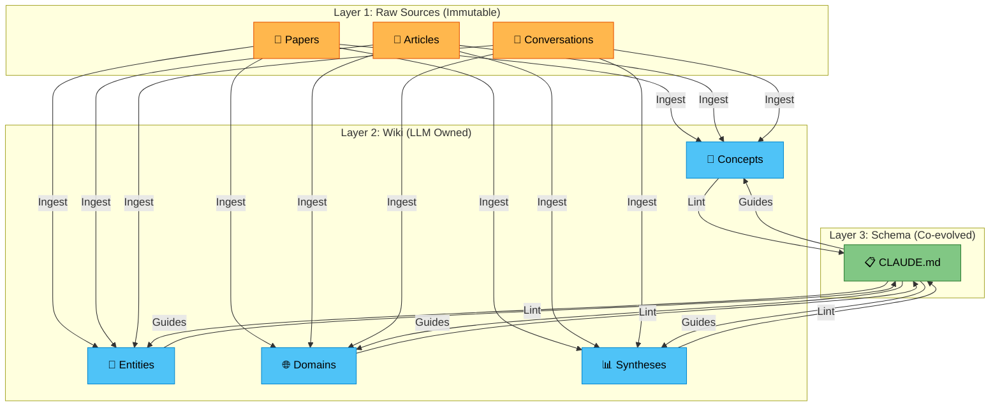

# LLM Wiki Pattern

> [!quote]
> *"The tedious part of maintaining a knowledge base is not the reading or the thinking — it's the bookkeeping."*
> — Andrej Karpathy

> [!definition] Core Idea
> LLM이 개인 지식 베이스를 **점진적으로 빌드하고 유지**하는 패턴.
> RAG(검색 후 생성)와의 결정적 차이: 지식이 **축적**된다.

Source: [[sources/karpathy-llm-wiki]]

---

## RAG vs LLM Wiki

| | RAG | LLM Wiki |
|---|---|---|
| **Query** | 매번 원본에서 재발견 | 이미 합성된 wiki에서 답변 |
| **Knowledge** | 축적 없음 | 소스가 늘수록 풍부해짐 (==복리 효과==) |
| **Cross-refs** | 쿼리 시 즉석 조합 | 이미 연결되어 있음 |
| **Maintenance** | 불필요 | LLM이 담당 (비용 거의 0) |
| **Contradictions** | 감지 어려움 | Lint 과정에서 적극 감지 |

---

## Architecture

### Layer 1 — Raw Sources (불변)
- 원본 문서, 논문, 기사, 데이터
- LLM은 ==읽기만== 하고 절대 수정하지 않음
- 진실의 소스 (source of truth)

### Layer 2 — Wiki (LLM 소유)
- LLM이 생성하고 유지하는 마크다운 파일들
- 요약, 엔티티, 개념, 크로스 레퍼런스, 종합 분석
- **사용자** → 읽기 / **LLM** → 쓰기

### Layer 3 — Schema (공동 진화)
- `CLAUDE.md`: wiki 구조, 컨벤션, 워크플로우 정의
- 사용자와 LLM이 함께 발전시킴
- LLM을 "generic 챗봇"이 아닌 "규율 있는 wiki 관리자"로 만드는 핵심

---

## Three Core Operations

### Ingest — 소스 추가
새 소스 추가 → LLM이 읽고 → 요약 작성 → 관련 페이지 업데이트 → 인덱스/로그 갱신.
하나의 소스가 ==10-15개== wiki 파일에 영향.

### Query — 질문
wiki에 질문 → LLM이 관련 페이지 검색 → 합성 + 인용으로 답변.
**가치 있는 답변은 wiki 페이지로 저장** → 탐구가 지식 베이스에 쌓임.

### Lint — 건강 검진
- 페이지 간 모순
- 구 정보 (새 소스로 superseded된 주장)
- orphan 페이지 (인바운드 링크 없음)
- 누락된 크로스 레퍼런스

---

## Why It Works

> [!insight] Key Insight
> 1. **유지보수 비용 ≈ 0**: LLM은 지치지 않음. 15개 파일을 한 번에 업데이트.
> 2. **복리 효과**: 소스가 늘수록 wiki가 더 풍부해짐. RAG는 매번 재발견.
> 3. **Vannevar Bush의 Memex 실현**: 연결(association)이 문서 자체만큼 가치 있음.

---

## Tool Stack

| Tool | Role |
|---|---|
| Obsidian | Wiki IDE — 링크, 그래프 뷰, 탐색 |
| Obsidian Web Clipper | 기사 → 마크다운 변환 |
| Graph View | wiki 토폴로지 시각화 |
| Dataview | frontmatter 쿼리로 동적 테이블 |
| Marp | wiki 내용으로 슬라이드 생성 |
| Git | 버전 히스토리 + 협업 |

---

## Application Domains

- **개인**: 목표, 건강, 심리, 자기계발 — 일기, 기사, 팟캐스트 노트
- **연구**: 수주~수개월에 걸친 논문 + 기사 심층 탐구
- **독서**: 챕터별 인제스트 → 캐릭터, 테마, 플롯 페이지
- **비즈니스**: Slack 스레드, 회의록, 고객 콜 → 팀 내부 wiki
- **이 vault**: AI/ML 연구 + 시네마 스튜디오 + 바이브 코딩

---

## Related Pages

- [[overview]] — 이 vault의 현재 상태
- [[sources/karpathy-llm-wiki]] — 원문 요약
