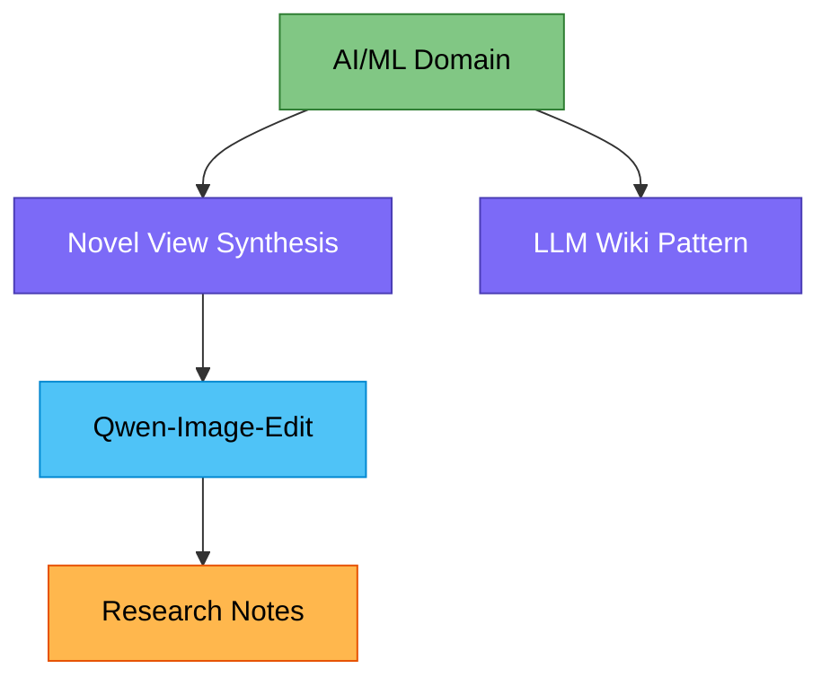

# AI/ML Domain

> [!info] Scope
> 이 vault의 AI/ML 지식 베이스 종합 페이지.
> 모델, 도구, 연구 트렌드를 추적.

---

## Current Coverage

### Image Generation / Editing

> [!model] Qwen-Image-Edit
> Alibaba, MMDiT 20B 멀티모달 이미지 생성/편집 모델
> - Novel view synthesis, identity-consistent editing
> - → [[entities/qwen-image]]

### Concepts

| Concept | Summary |
|---|---|
| [[concepts/novel-view-synthesis]] | 단일 이미지 → 새 시점 생성 |
| [[concepts/llm-wiki]] | LLM 기반 지식 베이스 패턴 (메타) |

---

## Knowledge Topology

---

## Knowledge Gaps

> [!todo] To Cover
> - Text-to-Image 최신 모델 비교 (Flux, SD3.5 등)
> - Video generation 현황
> - Multimodal LLM 최신 동향 (GPT-4o, Gemini, Claude 등)
> - AI 코딩 도구 현황 → [[domains/vibe-coding]]으로 분리

---

## Trending Topics

> [!tip] Awaiting Sources
> _소스 인제스트 후 업데이트 예정_

---

## Related Domains

- [[domains/vibe-coding]] — AI 코딩 도구, 에이전트 워크플로우
- [[domains/cinema-studio]] — 미디어 생성 도구 (AI 포함)
