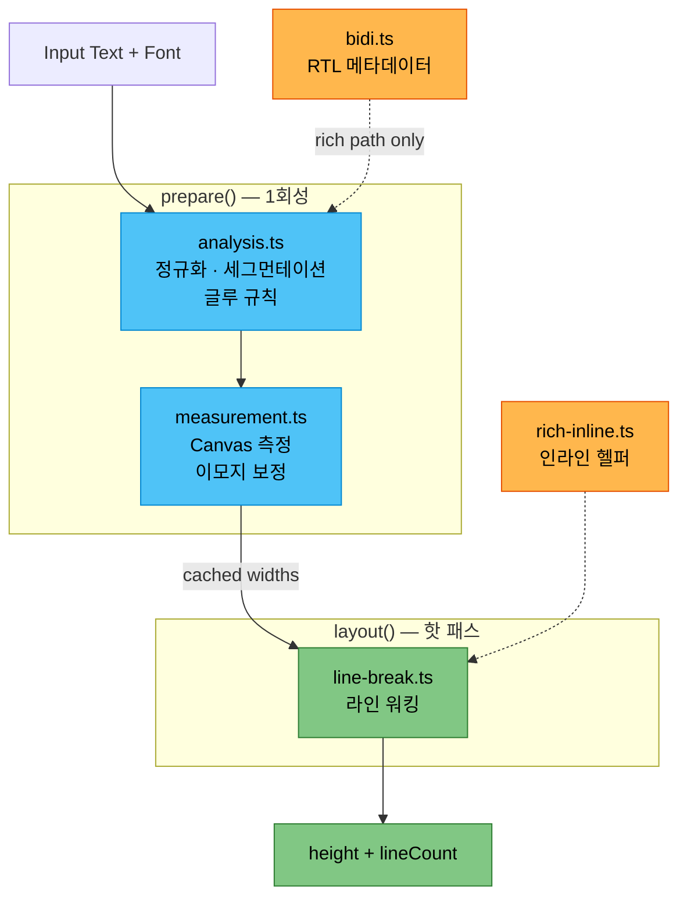

# Pretext

> [!model] Entity Card
> | Field | Value |
> |---|---|
> | **Type** | JavaScript/TypeScript Library |
> | **Package** | `@chenglou/pretext` |
> | **Version** | 0.0.5 |
> | **Author** | chenglou |
> | **License** | MIT |
> | **Repo** | https://github.com/chenglou/pretext |
> | **Demo** | https://chenglou.me/pretext/ |

Source: [[sources/pretext-analysis]]

---

## What It Does

> [!definition] Core Idea
> ==DOM reflow 없이== 멀티라인 텍스트 높이를 예측하고, Canvas/SVG/WebGL로 수동 레이아웃 렌더링.

- Canvas `measureText` + `Intl.Segmenter` 기반 자체 측정 로직
- 브라우저 폰트 엔진을 ground truth로 사용
- `layout()`은 순수 산술 — DOM 읽기, canvas 호출, 문자열 작업 없음

---

## API Surface

### Fast Path (높이 예측)

```ts
prepare(text, font, options?) → PreparedText
layout(prepared, maxWidth, lineHeight) → { height, lineCount }
```

### Rich Path (수동 레이아웃)

```ts
prepareWithSegments(text, font, options?) → PreparedTextWithSegments
layoutWithLines(prepared, maxWidth, lineHeight) → { lines[] }
walkLineRanges(prepared, maxWidth, onLine) → lineCount
measureLineStats(prepared, maxWidth) → { lineCount, maxLineWidth }
layoutNextLineRange(prepared, start, maxWidth) → range | null
materializeLineRange(prepared, range) → line
```

### Rich Inline (`@chenglou/pretext/rich-inline`)

```ts
prepareRichInline(items[]) → PreparedRichInline
walkRichInlineLineRanges(prepared, maxWidth, onLine)
materializeRichInlineLineRange(prepared, range)
```

혼합 폰트, 멘션/칩 (`break: 'never'`), `extraWidth` chrome 지원.

---

## Architecture



---

## Supported Languages

라틴, CJK (중국어/일본어/한국어), 아랍어, 히브리어, 태국어, 라오어, 크메르어, 미얀마어, 이모지, 유니코드 확장 영역.

---

## Use Cases

| Use Case | API | Description |
|---|---|---|
| 가상 스크롤 | `prepare()` + `layout()` | 아이템 높이 예측으로 정확한 가상화 |
| 채팅 버블 | `prepare()` + `layout()` | 높이 미리 계산, 레이아웃 시프트 제로 |
| Canvas 에디터 | `prepareWithSegments()` + `layoutWithLines()` | Figma/Excalidraw 스타일 텍스트 |
| 이미지 텍스트 흐름 | `layoutNextLineRange()` | 가변 폭 — 장애물 주변 라우팅 |
| CI/AI 테스트 | `prepare()` + `layout()` | 브라우저 없이 오버플로우 검증 |
| SVG/WebGL | `prepareWithSegments()` + `layoutWithLines()` | DOM 없는 환경 렌더링 |
| Shrinkwrap | `walkLineRanges()` | 최소 컨테이너 폭 계산 |

---

## Caveats

> [!warning]
> - `system-ui` 폰트 macOS에서 정확도 불안정
> - `break-all`, `strict`, `loose`, `anywhere` 미지원
> - 아랍어 fine-width 미세 차이 존재

---

## Version History

| Version | Date | Highlight |
|---|---|---|
| 0.0.0 | 2026-03-26 | Initial release |
| 0.0.2 | 2026-03-28 | `pre-wrap` mode |
| 0.0.3 | 2026-03-29 | ESM npm publish |
| 0.0.5 | 2026-04-09 | Rich helpers, `keep-all`, `rich-inline` |

---

## Related Pages

- [[sources/pretext-analysis]] — 원본 분석 문서
- [[domains/vibe-coding]] — AI 코딩, 프론트엔드 라이브러리
