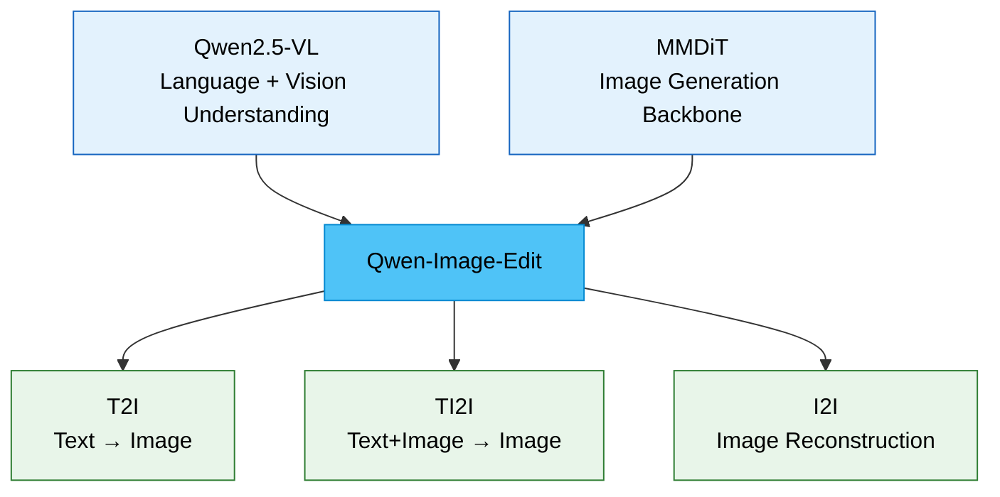

# Qwen-Image

> [!model] Model Card
> | Field | Value |
> |---|---|
> | **Developer** | Alibaba Qwen Team |
> | **Type** | Multimodal Image Generation + Editing |
> | **Architecture** | MMDiT (Multimodal Diffusion Transformer) |
> | **Parameters** | ~20B |
> | **Base Models** | Qwen2.5-VL + MMDiT backbone |

See also: [[concepts/novel-view-synthesis]]

---

## Model Lineage



---

## Capabilities

| Feature | Description |
|---|---|
| **Semantic editing** | 텍스트 지시로 이미지 의미론적 편집 |
| **Novel view synthesis** | 90°, 180° 회전 — 새 시점 이미지 생성 |
| **Identity consistency** | 원본 정체성 유지하며 보이지 않는 면 생성 |
| **View-conditioned editing** | 카메라 시점 텍스트 토큰으로 시점 제어 |

---

## Architecture Deep Dive

> [!architecture] Dual Encoding (Identity Preservation)
> ```
> 원본 이미지 ──→ Qwen2.5-VL ──→ Semantic features
>            └──→ VAE Encoder ──→ Visual appearance features
>                                           ↓
>                               MMDiT denoising
>                                           ↓
>                                새 시점 이미지
> ```

### View Conditioning

슬라이더/각도 값 → 텍스트 프롬프트 토큰:
```python
prompt = f"Rotate the camera {angle} degrees to the right"
# 또는: "bird's-eye view", "back view", "close-up"
```

---

## Training

- T2I + TI2I + I2I reconstruction ==동시 훈련==
- Qwen2.5-VL와 MMDiT의 latent 공간 정렬
- 결과: semantic control + visual appearance control 동시 가능

---

## Limitations

> [!limitation]
> - **Strict 3D consistency 미보장**: 기하학적 정확성보다 그럴듯한 외관 우선
> - **비대칭 물체 취약**: 앞면과 다른 뒷면 디자인 정확히 재현 어려움
> - **Hallucination**: 보이지 않는 부분은 통계적으로 그럴듯한 값으로 채움
> - **텍스트/로고 문제**: 뒷면 텍스트는 임의 생성될 수 있음

---

## Ecosystem

| Tool | Description | Link |
|---|---|---|
| HF Space (linoyts) | 앵글 슬라이더 인터페이스 | `spaces/linoyts/Qwen-Image-Edit-Angles` |
| ComfyUI multi-angle | ComfyUI 통합 노드 | `jtydhr88/ComfyUI-qwenmultiangle` |
| LoRA fine-tuning | 특정 물체 타입 정확도 향상 | — |

---

## References

- Blog: `qwenlm.github.io/blog/qwen-image-edit/`
- Paper: `huggingface.co/papers/2508.02324`
- GitHub: `QwenLM/Qwen-Image`

---

## Related Pages

- [[concepts/novel-view-synthesis]] — NVS 개념 상세
- [[domains/ai-ml]] — AI/ML 도메인 종합
- [[sources/qwen-research-notes]] — 원본 연구 노트
