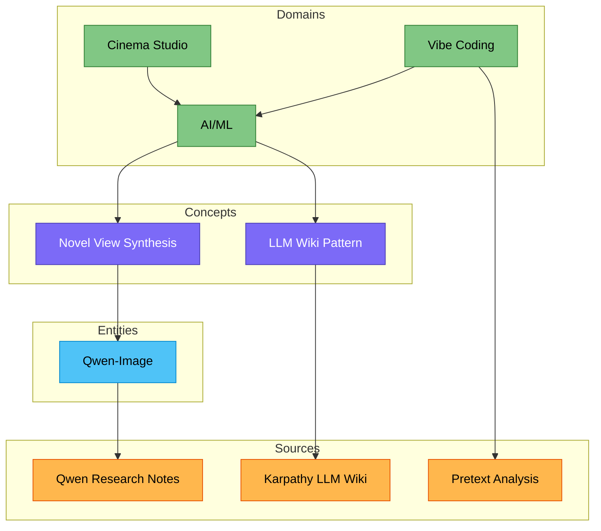

# Wiki Index

> [!abstract] Navigation Hub
> 이 vault의 모든 wiki 페이지 카탈로그. Claude는 새 페이지를 추가할 때마다 이 파일을 업데이트한다.

| | |
|---|---|
| **Last Updated** | 2026-04-18 |
| **Total Pages** | 13 |
| **Active Domains** | 3 |

---

## Overview

> [!quote] 
> *"The wiki stays maintained because the cost of maintenance is near zero."*
> — Andrej Karpathy

- [[overview]] — 전체 지식 베이스 big-picture 요약 및 현재 상태

---

## Knowledge Map

---

## Concepts

| Page | Summary | Tags |
|---|---|---|
| [[concepts/llm-wiki]] | Andrej Karpathy의 LLM wiki 패턴: 지속적으로 유지되는 개인 지식 베이스 | `#knowledge-management` `#pkm` |
| [[concepts/novel-view-synthesis]] | 단일 이미지에서 보이지 않는 시점의 이미지를 생성하는 기술 | `#computer-vision` `#3d` |

---

## Entities

| Page | Summary | Tags |
|---|---|---|
| [[entities/qwen-image]] | Alibaba Qwen 팀의 멀티모달 이미지 생성/편집 모델 (~20B) | `#model` `#multimodal` `#alibaba` |
| [[entities/pretext]] | DOM reflow 없는 텍스트 측정/레이아웃 JS/TS 라이브러리 | `#library` `#typography` `#canvas` |

---

## Domains

| Page | Summary | Status |
|---|---|---|
| [[domains/ai-ml]] | AI/ML 전반: 모델, 도구, 연구 트렌드 종합 | Active |
| [[domains/cinema-studio]] | 시네마 스튜디오 관련 지식 베이스 | Waiting |
| [[domains/vibe-coding]] | AI 보조 코딩, 에이전트 워크플로우, 프롬프트 엔지니어링 | Waiting |

---

## Sources

| Page | Author | Ingested |
|---|---|---|
| [[sources/karpathy-llm-wiki]] | Andrej Karpathy | 2026-04-10 |
| [[sources/qwen-research-notes]] | Claude (Research.md) | 2026-04-10 |
| [[sources/pretext-analysis]] | chenglou | 2026-04-18 |

---

## Syntheses

> [!todo] Coming Soon
> `/query`로 가치 있는 답변이 나오면 여기에 저장된다.
> 예: "X vs Y 비교", "이 도메인의 현재 상태", "두 소스 간 모순 분석"
