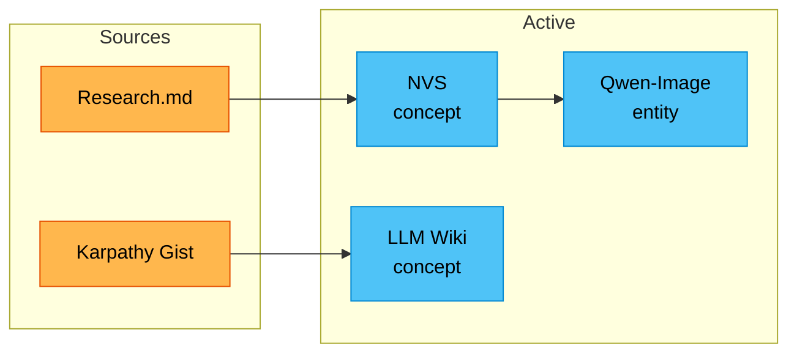

# Knowledge Base Overview

> [!info] Operating Principle
> 이 vault는 **LLM wiki 패턴**으로 운영된다.
> **Human** = 소스 큐레이션 + 방향 설정 + 좋은 질문
> **Claude** = wiki 생성/유지/업데이트 전부

---

## At a Glance

| Metric | Value |
|---|---|
| **Sources Ingested** | 3 |
| **Wiki Pages** | ~13 |
| **Active Domains** | 3 |
| **Since** | 2026-04-10 |

---

## Active Domains

### AI/ML
> [!tip] Primary Focus
> 모델, 연구, 도구. 현재 ==Qwen 이미지 생성 모델== 중심.

**Pages:** [[entities/qwen-image]] · [[concepts/novel-view-synthesis]] · [[concepts/llm-wiki]]
**Sources:** [[sources/karpathy-llm-wiki]] · [[sources/qwen-research-notes]] · [[sources/pretext-analysis]]

### Cinema Studio
> [!todo] Awaiting Sources
> 초기 구조만 있음. `Cinema Studio/` 폴더에서 소스 인제스트 대기 중.

**Expected:** 촬영 기법, 조명, 후반 작업, AI 영상 도구

### Vibe Coding
> [!todo] Awaiting Sources
> AI 보조 코딩 워크플로우. 초기 구조만 있음.

**Expected:** Claude Code, Cursor, 에이전트 패턴, MCP 설정

---

## Knowledge Topology

---

## Open Questions

> [!open-question] Research Questions
> - Qwen-Image의 strict 3D consistency 한계를 극복하는 방법은?
> - 비대칭 물체의 뒷면 생성 정확도를 높이려면?
> - Cinema Studio와 Vibe Coding 도메인에 첫 번째로 인제스트할 소스는?

---

## Next Ingest Candidates

> [!tip] Suggested
> 사용자가 제안하면 여기에 추가:
> - _비어있음 — 소스를 큐레이션해주세요!_

---

## Activity

최근 활동은 [[log]]에서 확인.
